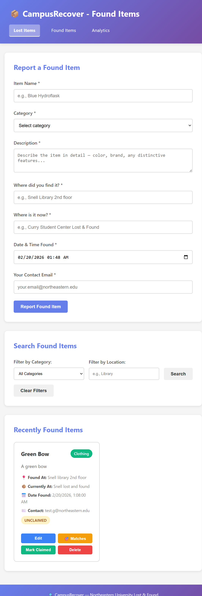
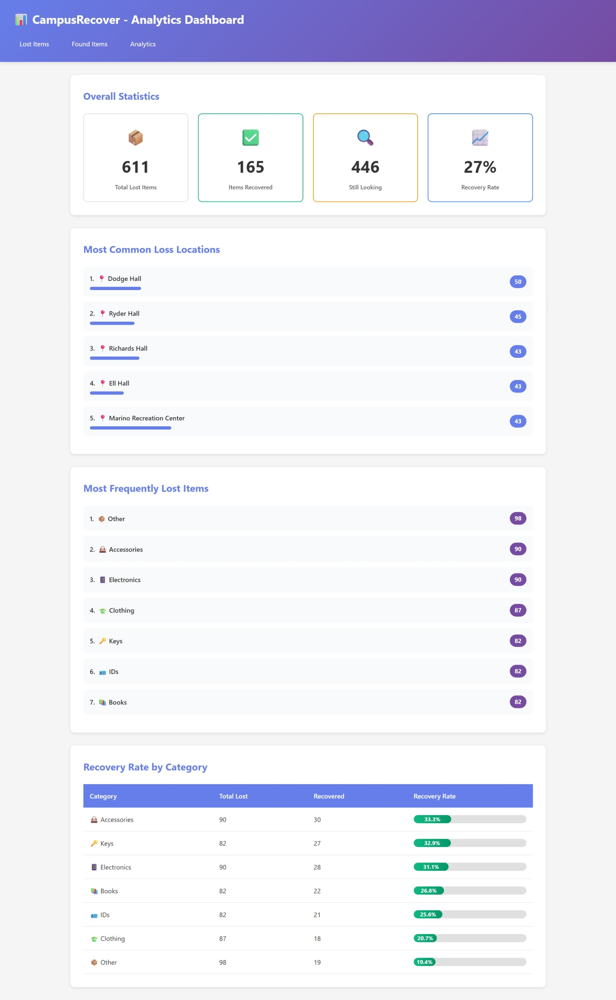
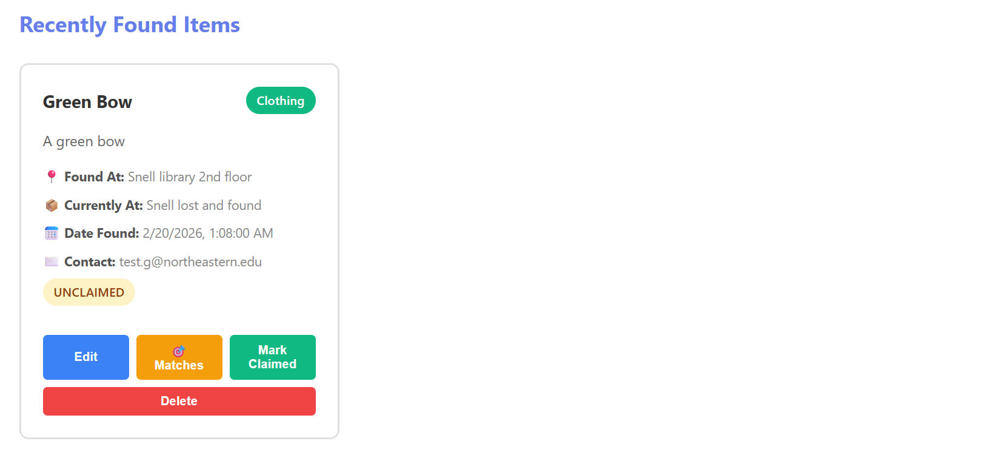

# CampusRecover - Smart Lost & Found Matching System

Campus-wide lost and found coordination platform that helps Northeastern University students recover lost items through structured reporting and intelligent matching.

## Authors

- Preshit Ravindra Pimple
- Gurudatt Pramod Gaonkar

## Class

[CS5610 Web Development - Spring 2026](https://johnguerra.co/classes/webDevelopment_spring_2025/)

## Project Objective

CampusRecover solves the problem of scattered lost and found reporting across campus by providing a centralized platform where students can:

- Report lost items with detailed descriptions and location information
- Report found items and receive intelligent match suggestions
- Search and filter through all reports by category and location
- View analytics on campus-wide recovery patterns and success rates

The platform reduces time between "item lost" and "item recovered" through smart matching algorithms that connect finders with owners automatically.

## Screenshots

### Lost Items Page


### Found Items Page



### Analytics Dashboard



### Smart Matching



## Features

### Lost Items Management

- ✅ Report lost items with detailed descriptions, location, and contact info
- ✅ Search and filter lost items by category and location
- ✅ Edit lost item reports to update details
- ✅ Mark items as recovered when found
- ✅ Delete lost item reports
- ✅ Smart sorting: Active items first (newest to oldest), recovered items last
- ✅ Date validation: Cannot report items lost in the future
- ✅ Pagination: 18 items per page for optimal performance

### Found Items Management

- ✅ Report found items with location found and current holding location
- ✅ Search and filter found items by category and location
- ✅ Edit found item reports to update pickup locations
- ✅ Mark items as claimed when returned to owner
- ✅ Delete found item reports
- ✅ Smart sorting: Unclaimed items first, claimed items last
- ✅ Date validation: Cannot report items found in the future
- ✅ Pagination: 18 items per page

### Smart Matching Algorithm

- ✅ Automatically suggests potential matches when viewing found items
- ✅ Scores matches based on 4 weighted criteria:
  - Category match (40 pts)
  - Location proximity (30 pts)
  - Timing within 7 days (20 pts)
  - Description keyword similarity (10 pts)
- ✅ Color-coded confidence levels: Green (≥70%), Yellow (≥40%), Gray (<40%)
- ✅ Explains why each item matched with human-readable reasons
- ✅ Displays owner contact information for immediate connection

### Analytics Dashboard

- ✅ Overall recovery statistics (total lost, recovered, active, recovery rate)
- ✅ Top 5 most common loss locations with visual bars
- ✅ Most frequently lost item categories
- ✅ Recovery rate breakdown by category with progress visualization
- ✅ Real-time data aggregation using MongoDB pipelines

## Tech Stack

- **Backend:** Node.js, Express.js
- **Database:** MongoDB Atlas (NodeJS native driver - no Mongoose)
- **Frontend:** Vanilla JavaScript (ES6 modules), HTML5, CSS3
- **Code Quality:** ESLint, Prettier
- **Development:** nodemon for auto-reload
- **Deployment:** Render.com

## Design Document

The full design document including project description, user personas, user stories, and wireframes is available here:

📄 [Design Document](docs/design-document.pdf)

## Video Demo

🎥 [Project Walkthrough Video](your-youtube-link-here)

Complete demonstration of all features including lost items reporting, found items with smart matching, and analytics dashboard.

## Deployment

**🌐 Live Site:** https://campusrecover-5v90.onrender.com

**Platform:** Render.com (free tier)

**⚠️ Note:** Free tier instances spin down after inactivity. First request may take 50+ seconds to wake up the service. Subsequent requests are fast.

## Prerequisites

- Node.js (v18 or higher)
- MongoDB Atlas account (or local MongoDB)
- Git
- npm

## Installation

### 1. Clone the Repository

```bash
git clone https://github.com/Preshit13/CampusRecover.git
cd CampusRecover
```

### 2. Install Dependencies

```bash
npm install
```

### 3. Environment Setup

Create a `.env` file in the root directory:

```env
MONGODB_URI=your_mongodb_atlas_connection_string
PORT=3000
```

**Note:**

- See `.env.example` for template
- Get MongoDB URI from MongoDB Atlas (free tier available)
- Never commit your `.env` file (already in .gitignore)

### 4. Seed Database (Optional)

To populate the database with 1000+ sample records for testing:

```bash
npm run seed
```

This creates:

- 600 lost items with varied categories, locations, and dates
- 400 found items with realistic data
- Mix of active/recovered and unclaimed/claimed statuses

### 5. Run the Application

**Development mode (with auto-reload):**

```bash
npm run dev
```

**Production mode:**

```bash
npm start
```

**Access the application:**

- Lost Items: http://localhost:3000
- Found Items: http://localhost:3000/found.html
- Analytics: http://localhost:3000/analytics.html

## Development Scripts

```bash
npm start          # Start production server
npm run dev        # Start development server with auto-reload
npm run seed       # Seed database with 1000+ sample records
npm run lint       # Run ESLint code quality checks
npm run format     # Format all code with Prettier
```

## API Endpoints

### Lost Items

| Method | Endpoint                                            | Description                                    |
| ------ | --------------------------------------------------- | ---------------------------------------------- |
| GET    | /api/lost-items?page=1&limit=18&category=&location= | Get paginated lost items with optional filters |
| GET    | /api/lost-items/:id                                 | Get single lost item by ID                     |
| POST   | /api/lost-items                                     | Create new lost item report                    |
| PUT    | /api/lost-items/:id                                 | Update lost item                               |
| PATCH  | /api/lost-items/:id/status                          | Mark item as recovered                         |
| DELETE | /api/lost-items/:id                                 | Delete lost item                               |

### Found Items

| Method | Endpoint                                             | Description                                     |
| ------ | ---------------------------------------------------- | ----------------------------------------------- |
| GET    | /api/found-items?page=1&limit=18&category=&location= | Get paginated found items with optional filters |
| GET    | /api/found-items/:id                                 | Get single found item by ID                     |
| POST   | /api/found-items                                     | Create new found item report                    |
| PUT    | /api/found-items/:id                                 | Update found item                               |
| PATCH  | /api/found-items/:id/status                          | Mark item as claimed                            |
| DELETE | /api/found-items/:id                                 | Delete found item                               |
| GET    | /api/found-items/:id/matches                         | Get smart match suggestions for a found item    |

### Analytics

| Method | Endpoint                            | Description                          |
| ------ | ----------------------------------- | ------------------------------------ |
| GET    | /api/analytics/recovery-stats       | Overall recovery statistics          |
| GET    | /api/analytics/common-locations     | Top 5 most common loss locations     |
| GET    | /api/analytics/item-types           | Most frequently lost item categories |
| GET    | /api/analytics/recovery-by-category | Recovery rate breakdown by category  |

## Database Schema

### lost_items Collection

```javascript
{
  _id: ObjectId,
  itemName: String,           // e.g., "iPhone 13 Pro"
  category: String,           // Electronics | Accessories | Clothing | Books | IDs | Keys | Other
  description: String,        // Detailed description with distinctive features
  location: String,           // Last seen location
  dateTime: Date,            // When item was lost
  contactInfo: String,       // Owner's email
  status: String,            // "active" | "recovered"
  createdAt: Date,           // When report was created
  updatedAt: Date            // Last modification timestamp
}
```

### found_items Collection

```javascript
{
  _id: ObjectId,
  itemName: String,           // e.g., "Black Wallet"
  category: String,           // Electronics | Accessories | Clothing | Books | IDs | Keys | Other
  description: String,        // Detailed description
  locationFound: String,      // Where item was found
  currentLocation: String,    // Where item is currently being held
  dateTime: Date,            // When item was found
  contactInfo: String,       // Finder's email
  status: String,            // "unclaimed" | "claimed"
  createdAt: Date,           // When report was created
  updatedAt: Date            // Last modification timestamp
}
```

## Project Structure

```
CampusRecover/
├── server/
│   ├── db/
│   │   └── database.js              # MongoDB connection module
│   ├── routes/
│   │   ├── lostItems.js             # Lost items CRUD + pagination
│   │   ├── foundItems.js            # Found items CRUD + pagination
│   │   └── analytics.js             # Analytics aggregation routes
│   └── utils/
│       └── matchingAlgorithm.js     # Smart matching logic
├── public/
│   ├── index.html                   # Lost items page
│   ├── found.html                   # Found items page
│   ├── analytics.html               # Analytics dashboard
│   ├── css/
│   │   ├── main.css                # Global styles
│   │   ├── lostItems.css           # Lost items page styles
│   │   ├── foundItems.css          # Found items page styles
│   │   ├── analytics.css           # Analytics page styles
│   │   └── navigation.css          # Navigation bar styles
│   └── js/modules/
│       ├── lostItems.js            # Lost items frontend logic
│       ├── foundItems.js           # Found items frontend logic
│       ├── analytics.js            # Analytics frontend logic
│       └── matching.js             # Matching display logic
├── scripts/
│   └── seed.js                     # Database seeding script (1000+ records)
├── screenshots/
│   ├── lost-items.png              # Lost items page screenshot
│   ├── found-items.png             # Found items page screenshot
│   ├── analytics.png               # Analytics page screenshot
│   └── matching.png                # Matching modal screenshot
├── docs/
│   └── design-document.pdf         # Complete design documentation
├── .env.example                    # Environment variables template
├── .gitignore                      # Git ignore rules
├── eslint.config.js                # ESLint configuration
├── .prettierrc                     # Prettier configuration
├── vercel.json                     # Deployment configuration
├── package.json                    # Project dependencies and scripts
├── server.js                       # Express application entry point
├── LICENSE                         # MIT License
└── README.md                       # This file
```

## Code Quality

- ✅ **ESLint:** Configured and passing with zero errors
- ✅ **Prettier:** All files formatted consistently
- ✅ **ES6 Modules:** Using import/export throughout (no require statements)
- ✅ **Client-Side Rendering:** Vanilla JavaScript, no frameworks
- ✅ **MongoDB Native Driver:** No Mongoose used
- ✅ **No Template Engines:** Pure HTML with client-side rendering
- ✅ **Semantic HTML:** Proper button, form, and input tags
- ✅ **Modular CSS:** Separate CSS file for each page/component
- ✅ **Secure Credentials:** Environment variables in .env (not committed)
- ✅ **Clean Code:** No leftover template files or unused code

## License

This project is licensed under the MIT License - see the [LICENSE](LICENSE) file for details.

## Acknowledgments

- **Course:** CS5610 Web Development, Northeastern University
- **Instructor:** Professor John Alexis Guerra Gomez
- **Database:** MongoDB Atlas
- **Deployment:** Render.com
- **Built with:** Node.js, Express, MongoDB, and Vanilla JavaScript

---

**CS5610 Web Development - Spring 2026**
**Northeastern University**
